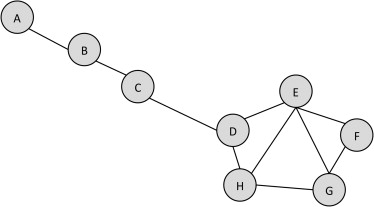

# social-network-analysis

## Requirements 
- C++ 
- Qt creator 
## Description

### Degree centrality 
Degree centrality is a simple count of the total number of connections linked to a vertex. It can be thought of as a kind of popularity measure, but a crude one that does not recognize a difference between quantity and quality. Degree centrality does not differentiate between a link to the president of the United States and a link to a high school dropout. Degree is the measure of the total number of edges connected to a particular vertex.
The degree centrality for a node is simply its degree. A node with 10 social connections would have a degree centrality of 10. A node with 1 edge would have a degree centrality of 1.
### Closeness centrality
Closeness centrality indicates how close a node is to all other nodes in the network. It is calculated as the average of the shortest path length from the node to every other node in the network. consider the figure 

Let’s start by computing the average shortest path length of node D.  
The follwoing table shows each node and the length of the shortest path from D.

| Node | Shortest Path from D |
| ------------- | ------------- |
| A  | 3 (D–C–B–A) |
| B  | 2   |
| C  |  1             |
| D  |   1            |
| E  |    2           |
| F  |     2          |
| G  |     1          |

Node	Shortest Path from D
A	      3 (D–C–B–A)
B	      2
C	      1
E	      1
F	      2
G	      2
H	      1  
The average of those shortest path lengths is: (3+2+1+1+2+2+1)/7 =12/7 =1.71  
Note that we divide by 7 because there are seven other nodes.  
Now repeat this for node A  
Node	Shortest Path from A
B	        1
C	        2
D	        3
E	        4
F	        5
G	        5
H	        4
Here, the average shortest path length is: (1+2+3+4+5+5+4) = 24/7 = 3.43  
In the case of closeness centrality, or average shortest path length, lower values indicate more central nodes. Thus, since node D’s closeness centrality is 1.71 and node A’s is 3.43, node D is more central by this measure.  
The benefits of closeness centrality are that it indicates nodes as more central if they are closer to most of the nodes in the graph. This strongly corresponds to visual centrality—a node that would appear toward the center of a graph when we draw it usually has a high closeness centrality.  

